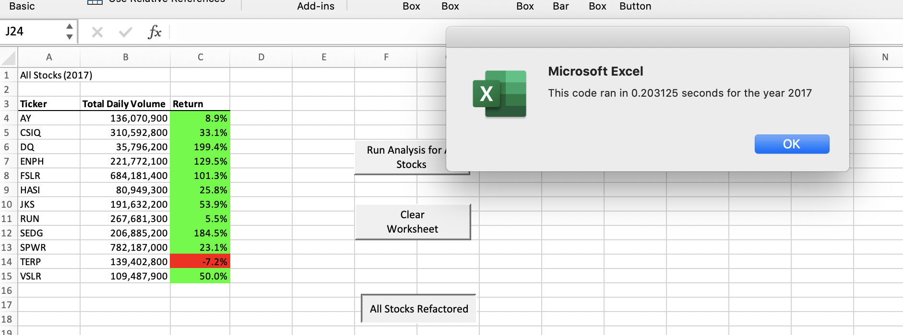
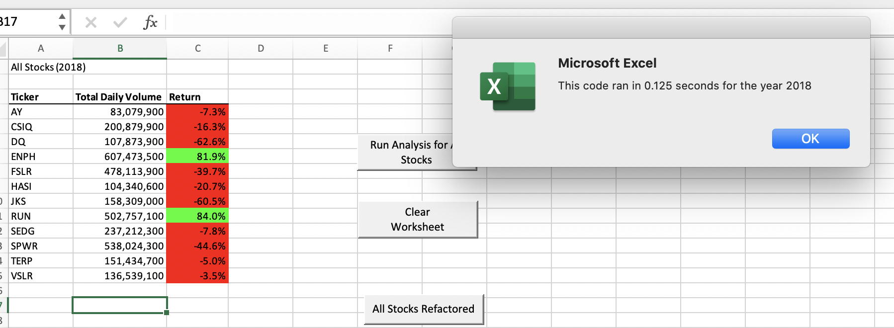

# stock-analysis

## Overview
The objective of this project was to calculate the stock performance of different energy and solar companies. Using VBA/Excel this process had to be automated with code so results could be known almost immediately. Prices from 2017 and 2018 were calculated so that those who wanted to purchase stocks had a clear picture of the highest performing.

## Results

2017 Data

2018Data

The results show that in 2017 the solar sector had a better performance overall. In 2018, only two companies posted positive results for the entire year.
